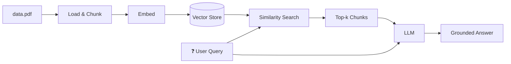

# RAG-Based Chat Model


A simple **Retrieval-Augmented Generation (RAG)** chat application that answers questions about **Deep Learning concepts**, from the fundamentals up to **Activation Functions**. It retrieves relevant context from a PDF document and uses an LLM to generate grounded answers. A **FastAPI** server is included for serving the model.

---

## Features

- PDF document loading and preprocessing
- Text chunking / splitting
- Vector embeddings stored in a vector database
- Semantic retrieval of relevant chunks
- LLM-powered answer generation grounded in retrieved context
- FastAPI endpoint for serving the chat model
- Fast dependency management with [uv](https://github.com/astral-sh/uv)

---

## Project Structure

```text
RAG_Based_chat_model/
│
├── api/
│   └── app.py              # FastAPI server (exposes chat endpoint)
│
├── document/
│   └── data.pdf            # Source PDF (Deep Learning concepts)
│
├── src/
│   ├── loader.py           # Loads PDF, chunks it, and builds the vector store
│   ├── retreval.py         # Retrieval logic (similarity search)
│   └── main.py             # LLM setup + get_answer() pipeline
│
├── pyproject.toml          # uv project config & dependencies
├── uv.lock                 # Locked dependency versions
└── README.md
```

---

## How It Works



1. **Load** — `src/loader.py` loads `document/data.pdf` and splits it into chunks.
2. **Embed & Store** — Chunks are embedded and stored in a vector database.
3. **Retrieve** — `src/retreval.py` performs a similarity search for the user query and returns the top relevant chunks.
4. **Generate** — `src/main.py` sends the retrieved context plus the query to the LLM to produce the final answer.
5. **Serve** — `api/app.py` wraps the pipeline in a FastAPI endpoint.

> **Scope:** The model is intentionally limited to Deep Learning topics, from fundamental DL concepts through activation functions. It answers only from content retrieved from the PDF.

---

## Tech Stack

| Component       | Tool / Library                 |
| --------------- | ------------------------------ |
| Language        | Python                         |
| Package Manager | uv                             |
| PDF Loading     | LangChain / PyPDF              |
| Embeddings      | *(HuggingFace)* |
| Vector Store    | *(Chroma)*       |
| LLM             | *(Hugging Face)*  |
| API Framework   | FastAPI + Uvicorn              |

> 💡 Replace the italicized entries with the exact tools you used.

---

## Setup

### Prerequisites

- Python **3.10+**
- [uv](https://github.com/astral-sh/uv) installed

### Installation

```bash
# Clone the repository
git clone <your-repo-url>
cd RAG_Based_chat_model

# Install dependencies
uv sync
```

### Environment Variables

Create a `.env` file in the project root with the API keys for your chosen LLM provider:

```env
HF_ACCESS_TOKEN=your_api_key_here
# or other provider keys as needed
```

> Never commit your `.env` file. Make sure it is listed in `.gitignore`.

---

## Usage

### 1. Build the vector store (first time only)

```bash
uv run python src/loader.py
```

This loads the PDF, chunks it, and persists the vector store.

### 2. Test the RAG pipeline locally

```bash
uv run python src/main.py
```

### 3. Run the FastAPI server

```bash
uv run uvicorn api.app:app --reload
```

| Resource         | URL                           |
| ---------------- | ----------------------------- |
| Server           | http://127.0.0.1:8000         |
| Interactive docs | http://127.0.0.1:8000/docs    |

---

## API Reference

### `POST /chat`

**Request**

```json
{
  "query": "What is the ReLU activation function?"
}
```

**Response**

```json
{
  "answer": "ReLU (Rectified Linear Unit) is defined as f(x) = max(0, x)..."
}
```

**Example with cURL**

```bash
curl -X POST "http://127.0.0.1:8000/chat" \
  -H "Content-Type: application/json" \
  -d '{"query": "What is the ReLU activation function?"}'
```

---

## Notes

- Retrieval is limited to the content of `document/data.pdf`.
- If a query falls outside the Deep Learning scope of the PDF, the model may respond that it cannot find relevant information.
- You can swap the LLM or embedding model by editing `src/main.py` and `src/loader.py`.

---

## Future Improvements

- [ ] Support for multiple documents
- [ ] Conversation memory (multi-turn chat)
- [ ] Streaming responses
- [ ] Reranking for better retrieval quality
- [ ] Dockerize the app for deployment

---

## License

This project is for educational purposes. Feel free to modify and extend.
